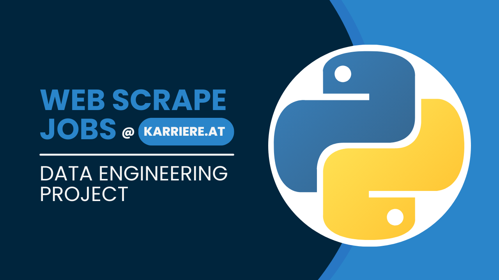

# webscraping_karriere
Automating job search in Python

Downgrade Python version using Virtual Environments 
```bash
python3 --version 
virtualenv -p python3.12 myenv 
source myenv/bin/activate 
pip install numpy scipy 
pip install mysql-connector-python
pip install pandas
pip install scikit-learn 
pip install pdfplumber 
python job_matching.py 
deactivate
```
While running job_matching.py make sure you have cv.pdf file in your folder

### Video Tutorials

Here are some helpful tutorials to guide you through the process:

1. [Web Scrape Jobs from Karriere to CSV | an End to End Data Engineering Project Pt 1](https://youtu.be/oCR23dxyrKQ)
2. [Web Scrape Jobs from Karriere to CSV | an End to End Data Engineering Project Pt 2](https://youtu.be/bgEWYEijF5s)
3. [Feature Engineering with Python | an End to End Data Engineering Project Pt 3](https://youtu.be/6pLSVMhOPCI)
4. [Preprocessing and Cleaning Data with Python | an End to End Data Engineering Project Pt 4](https://youtu.be/WBziZ1ufCtA)
5. [Web Scrape Jobs from Karriere to MySQL DB | an End to End Data Engineering Project Pt 5](https://youtu.be/ZPzW8v8jCV4)
6. [Job Matching with Cosine Similarity | an End to End Data Engineering Project Pt 6](https://youtu.be/PI179cWrcfo)

